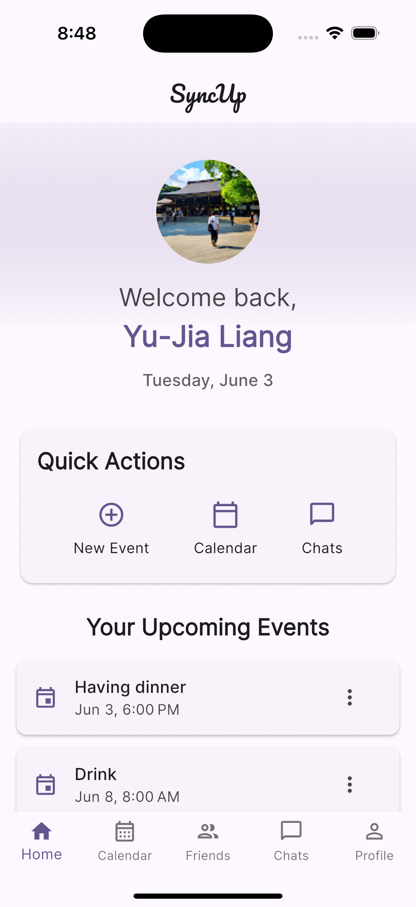
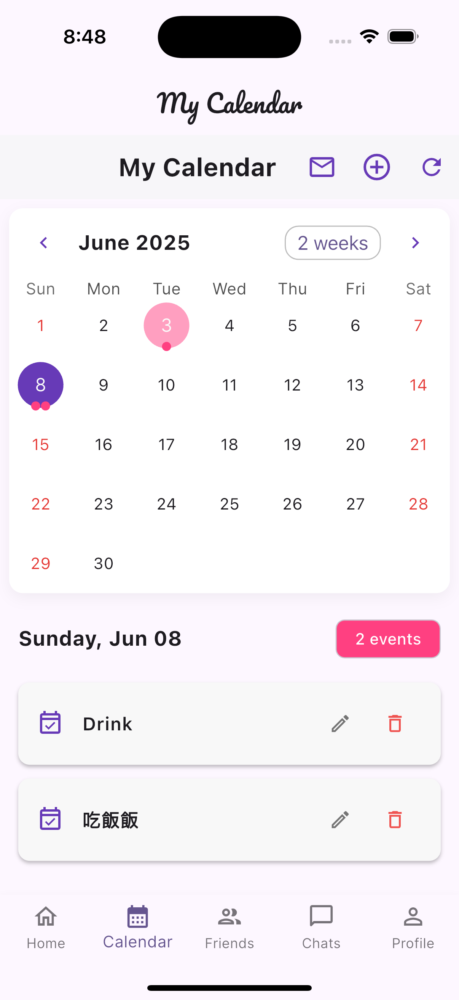
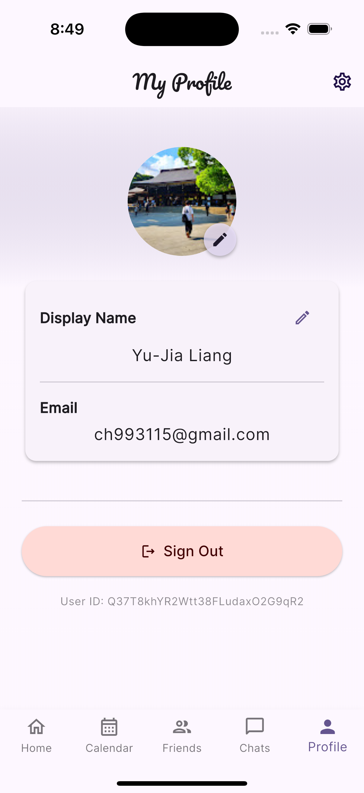

# SyncUp - Social Calendar App

[English](#english) | [繁體中文](#繁體中文)

## English

### Overview
SyncUp is a modern social calendar application built with Flutter that helps you coordinate activities and events with friends. It combines the power of social networking with practical calendar management features.

### Screenshots
<table>
<tr>
<td><br>Home Screen</td>
<td><br>Calendar View</td>
<td><br>Friends List</td>
</tr>
<tr>
<td><br>Chat Interface</td>
<td><br>Profile Page</td>
<td></td>
</tr>
</table>

### Features
- 📅 **Smart Calendar Management**
  - Interactive calendar interface
  - Event creation and sharing
  - Event invitations and RSVPs
  - Location-based event suggestions

- 👥 **Social Features**
  - Friend management system
  - Real-time chat with friends
  - Read receipts for messages
  - Event sharing and collaboration

- 📱 **Modern UI/UX**
  - Clean and intuitive interface
  - Dark/Light theme support
  - Smooth animations
  - Responsive design

- 🔒 **Security & Privacy**
  - Firebase Authentication
  - Google Sign-In integration
  - Secure data storage
  - Privacy-focused design

### Technical Stack
- **Frontend**: Flutter (Dart)
- **Backend**: Firebase
  - Firebase Authentication
  - Cloud Firestore
  - Firebase Storage
- **APIs & Services**
  - Google Maps API
  - Google Places API
  - Google Generative AI

### Setup

#### API Keys and Configuration

This project uses several API keys that need to be configured before running the app. For security reasons, these keys are not included in the repository. You'll need to set up your own keys and configuration files:

1. Create a `.env` file in the root directory with the following variables:
```
FIREBASE_API_KEY=your_firebase_api_key
FIREBASE_AUTH_DOMAIN=your_firebase_auth_domain
FIREBASE_PROJECT_ID=your_firebase_project_id
FIREBASE_STORAGE_BUCKET=your_firebase_storage_bucket
FIREBASE_MESSAGING_SENDER_ID=your_firebase_messaging_sender_id
FIREBASE_APP_ID=your_firebase_app_id
GOOGLE_MAPS_API_KEY=your_google_maps_api_key
GEMINI_API_KEY=your_gemini_api_key
```

2. For iOS:
   - Copy `ios/Flutter/keys.xcconfig.template` to `ios/Flutter/keys.xcconfig`
   - Copy `ios/Runner/GoogleService-Info.plist.template` to `ios/Runner/GoogleService-Info.plist`
   - Update the values in both files with your actual API keys

3. For Android:
   - Copy `android/app/google-services.json.template` to `android/app/google-services.json`
   - Update the values with your actual Firebase configuration

#### Getting API Keys

1. Firebase Configuration:
   - Go to the [Firebase Console](https://console.firebase.google.com/)
   - Create a new project or select an existing one
   - Add your app to the project
   - Download the configuration files (google-services.json for Android and GoogleService-Info.plist for iOS)

2. Google Maps API Key:
   - Go to the [Google Cloud Console](https://console.cloud.google.com/)
   - Enable the Maps SDK for iOS and Android
   - Create credentials (API key)
   - Restrict the API key to your app's bundle ID/package name

3. Gemini API Key:
   - Go to the [Google AI Studio](https://makersuite.google.com/app/apikey)
   - Create a new API key
   - Copy the key to your .env file

### Getting Started
1. Clone the repository
2. Install Flutter dependencies:
   ```bash
   flutter pub get
   ```
3. Set up Firebase:
   - Create a Firebase project
   - Add your Firebase configuration
   - Enable Authentication and Firestore
4. Configure environment variables:
   - Create a `.env` file
   - Add required API keys
5. Run the app:
   ```bash
   flutter run
   ```

### Requirements
- Flutter SDK >= 3.0.0
- Dart SDK >= 3.0.0
- Firebase account
- Google Cloud Platform account (for Maps and Places APIs)

---

## 繁體中文

### 概述
SyncUp 是一個使用 Flutter 構建的現代社交日曆應用程式，幫助您與朋友協調活動和事件。它結合了社交網絡的強大功能和實用的日曆管理功能。

### 應用截圖
<table>
<tr>
<td><br>主頁面</td>
<td><br>日曆視圖</td>
<td><br>好友列表</td>
</tr>
<tr>
<td><br>聊天界面</td>
<td><br>個人資料頁面</td>
<td></td>
</tr>
</table>

### 功能特點
- 📅 **智能日曆管理**
  - 互動式日曆界面
  - 事件創建和分享
  - 活動邀請和回覆
  - 基於位置的事件建議

- 👥 **社交功能**
  - 好友管理系統
  - 即時聊天功能
  - 訊息已讀回執
  - 活動分享和協作

- 📱 **現代化界面**
  - 簡潔直觀的設計
  - 深色/淺色主題支持
  - 流暢的動畫效果
  - 響應式設計

- 🔒 **安全性與隱私**
  - Firebase 身份驗證
  - Google 登入整合
  - 安全數據存儲
  - 注重隱私的設計

### 技術架構
- **前端**: Flutter (Dart)
- **後端**: Firebase
  - Firebase 身份驗證
  - Cloud Firestore
  - Firebase 存儲
- **API 與服務**
  - Google Maps API
  - Google Places API
  - Google 生成式 AI

### 設定

#### API 金鑰與設定

本專案在執行前需要設定多組 API 金鑰。為了安全，這些金鑰不會包含在版本庫中。你需要自行建立並設定下列檔案：

1. 在專案根目錄建立 `.env` 檔案，內容如下：
```
FIREBASE_API_KEY=你的 Firebase API 金鑰
FIREBASE_AUTH_DOMAIN=你的 Firebase Auth Domain
FIREBASE_PROJECT_ID=你的 Firebase Project ID
FIREBASE_STORAGE_BUCKET=你的 Firebase Storage Bucket
FIREBASE_MESSAGING_SENDER_ID=你的 Firebase Messaging Sender ID
FIREBASE_APP_ID=你的 Firebase App ID
GOOGLE_MAPS_API_KEY=你的 Google Maps API 金鑰
GEMINI_API_KEY=你的 Gemini API 金鑰
```

2. iOS 設定：
   - 複製 `ios/Flutter/keys.xcconfig.template` 為 `ios/Flutter/keys.xcconfig`
   - 複製 `ios/Runner/GoogleService-Info.plist.template` 為 `ios/Runner/GoogleService-Info.plist`
   - 將上述檔案中的內容替換為你自己的 API 金鑰

3. Android 設定：
   - 複製 `android/app/google-services.json.template` 為 `android/app/google-services.json`
   - 將內容替換為你自己的 Firebase 設定

#### 取得 API 金鑰

1. Firebase 設定：
   - 前往 [Firebase 控制台](https://console.firebase.google.com/)
   - 建立新專案或選擇現有專案
   - 將你的 App 加入專案
   - 下載設定檔（Android 用 google-services.json，iOS 用 GoogleService-Info.plist）

2. Google Maps API 金鑰：
   - 前往 [Google Cloud Console](https://console.cloud.google.com/)
   - 啟用 Maps SDK for iOS 與 Android
   - 建立 API 金鑰
   - 建議將金鑰限制於你的 App Bundle ID 或 Package Name

3. Gemini API 金鑰：
   - 前往 [Google AI Studio](https://makersuite.google.com/app/apikey)
   - 建立新的 API 金鑰
   - 複製金鑰到 `.env` 檔案

### 開始使用
1. 克隆儲存庫
2. 安裝 Flutter 依賴：
   ```bash
   flutter pub get
   ```
3. 設定 Firebase：
   - 建立 Firebase 專案
   - 加入你的 Firebase 設定
   - 啟用身份驗證與 Firestore
4. 設定環境變數：
   - 建立 `.env` 檔案
   - 加入所需 API 金鑰
5. 執行應用程式：
   ```bash
   flutter run
   ```

### 系統需求
- Flutter SDK >= 3.0.0
- Dart SDK >= 3.0.0
- Firebase 帳戶
- Google Cloud Platform 帳戶（用於 Maps 和 Places APIs）
